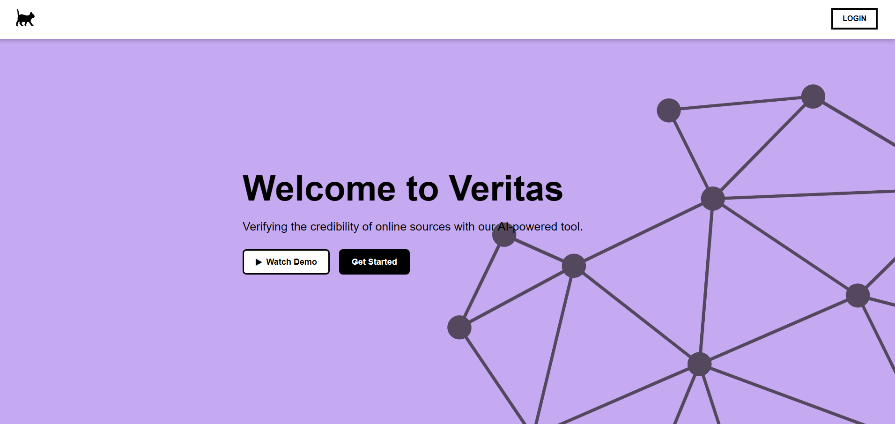

# Veritas – Misinformation Detection 

Veritas is a smart and scalable web platform designed to detect misinformation using **Machine Learning**, **Django**, and **Blockchain** technologies. This repository showcases the project for presentation and documentation purposes.

## About the Project

This application was built as part of a university group project and leverages:

-  **Machine Learning**: Logistic Regression for classifying fake vs real news.
-  **User Authentication**: Google OAuth integration.
-  **Blockchain Logging**: Hash-based result storage for integrity and verification.
-  **Scalable Deployment**: Docker Compose with PostgreSQL, Gunicorn, and Nginx for deployment and scalability.

## Tech Stack

- **Backend**: Django, Gunicorn
- **Frontend**: HTML, CSS
- **Database**: PostgreSQL
- **Deployment**: Docker Compose, Nginx
- **Other**: Google OAuth

---

> **Note:** This repository is for demonstration purposes and does not contain the full application source code, which is hosted privately.
